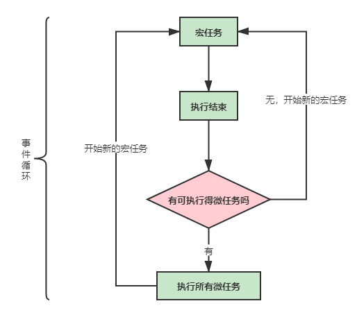

# 事件循环机制

## 开篇

> * javascript是单线程语言
> * Event Loop是javascript的执行机制

## 同步和异步的概念


> 上图解读：任务执行顺序
>
> * `同步`和`异步`任务人别进入不同的执行`场所`，同步的进入`主线程`，异步的进入`Event Table`并注册函数
> * 当指定的事情完成时，`Event Table`会将这个函数移入`Event Queue`
> * `主线程`内的任务执行完毕后（即主线程任务为空），会去`Event Queue`读取对应的函数，进入`主线程`执行
> * 上述会过程不断重复，就形成了常说的`Event Loop事件循环`
>
> 例如
>
> ```javascript
> let data = [];
> $.ajax({
>     url:www.javascript.com,
>     data:data,
>     success:() => {
>         console.log('发送成功!');
>     }
> })
> console.log('代码执行结束');
> ```
> 解析：
>
> * 执行let data = [];
> * ajax进入`Event Table`，注册回调函数success
> * 执行console.log(xxx);
> * ajax事件完成，回调函数success进入Event Queue
> * `主线程`从`Event Queue`读取回调函数success并执行

## 微任务MicroTasks和宏任务MacroTasks

> __概念__：
>
> * 宏任务：包括`整体代码script`、`setTimeout`、`setInterval`、`setImmediate`、`I/O`、`UI render`
> * 微任务：`Promise.then`（async/await实际上也是这个）、`process.nextTick`(node的)、`MutationObserver`（html5新特性，vue的$nextTick实现原理就是这个）
>
> __差异__：
>
> * 微任务和宏任务都是异步任务，都属于同一个队列
> * 区别在于他们的执行顺序，`Event Loop`的走向和取值
>
> __执行流程__：（看下图）
>
> * 执行宏任务，然后执行该宏任务产生的微任务，若微任务在执行过程中产生了新的微任务，则继续执行微任务
> * 微任务执行完毕后，开始新的宏任务，即进入中进行下一轮任务循环

执行流程图



能正确输出下面的例子，就没啥问题了

```javascript
console.log('1');

setTimeout(function() {
    console.log('2');
    process.nextTick(function() {
        console.log('3');
    })
    new Promise(function(resolve) {
        console.log('4');
        resolve();
    }).then(function() {
        console.log('5')
    })
})
process.nextTick(function() {
    console.log('6');
})
new Promise(function(resolve) {
    console.log('7');
    resolve();
}).then(function() {
    console.log('8')
})

setTimeout(function() {
    console.log('9');
    process.nextTick(function() {
        console.log('10');
    })
    new Promise(function(resolve) {
        console.log('11');
        resolve();
    }).then(function() {
        console.log('12')
    })
})

// 正确输入为：1，7，6，8，2，4，3，5，9，11，10，12
```


文章参考：[JS事件循环机制（event loop）之宏任务/微任务](https://juejin.cn/post/6844903638238756878#heading-0)