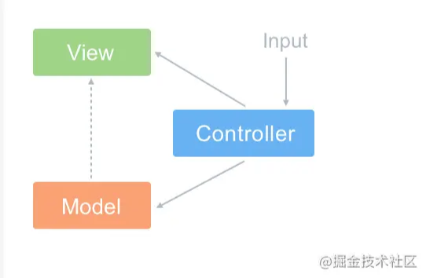
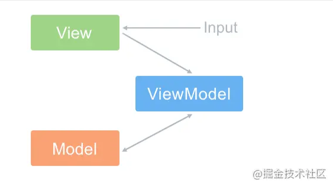
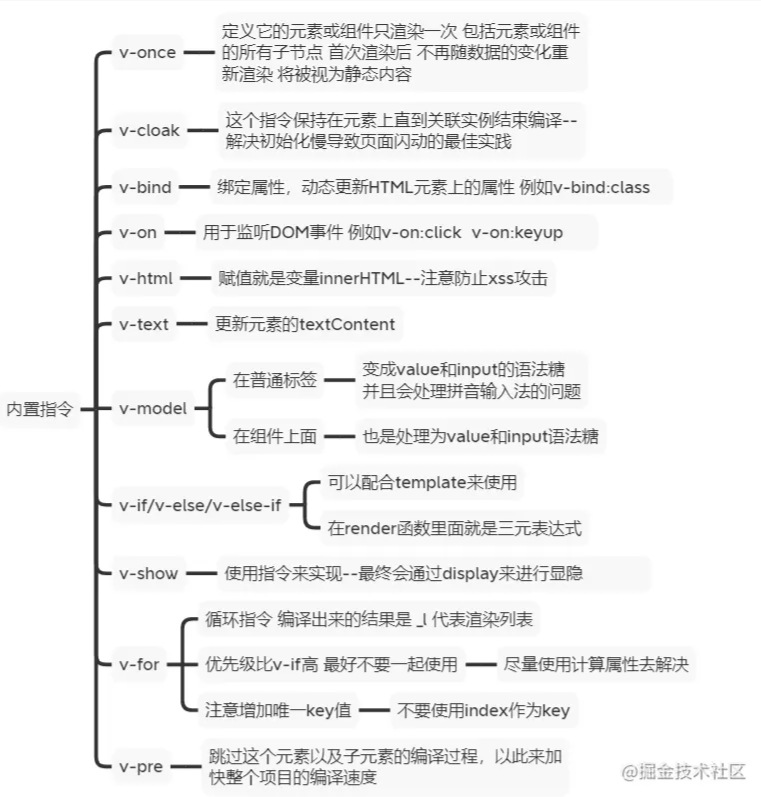

# Vue

> 本目录关注`Vue`框架的面试向问题，非源码解析，主要是原理理解，源码解析会另外开一个目录

## 1. Vue的`优点`和`缺点`

* 优点：渐进式、组件化、轻量级、虚拟dom、响应式、单页面路由、数据与视图分开
* 缺点：单页面不利于seo、不支持ie8以下、首屏加载时间长（？？）

## 2. 什么是渐进式框架

> * 通俗讲，可以只用一部分功能，而不必使用其全部，并且可以跟其它框架结合使用
> * 框架做分层设计，每层都可选，不同层可以灵活接入其他方案。而当你都想用官方的实现时，会发现也早已准备好，各层之间包括配套工具都能比接入其他方案更便捷地协同工作
> * 详细的话可以看[Vue2.0 中，“渐进式框架”和“自底向上增量开发的设计”这两个概念是什么？](https://www.zhihu.com/question/51907207)

## 3. MVVM和MVC

> `MVC`：
>
> 
>
> * `Model（模型）`：程序中用于处理数据逻辑的部分，通常负责在数据库中存取数据
> * `View（视图）`：程序中处理数据展示的部分，通常是依据模型数据创建的
> * `Controller（控制器）`：程序中处理用户交互的部分，通常负责从视图读取数据，控制用户输入，并向模型发送数据
> * `思想`：`Controller`将`Model`的数据用`View`展示出来（即在`Controller`里把`Model`的数据赋值给`View`）
>
> `MVVM`：
>
> 
>
> * `VM`（ViewModel）：在vue中无法观察到的，它主要实现了数据的双向绑定将Model，即
>   * `模型`转化成`视图`，即将后端返回的数据转化成所看到的页面（数据绑定）
>   * `视图`转化成`模型`，即将所看到的页面转化成后端的数据（DOM事件监听）
>
> `区别`：
>
> * MVVM实现了Model和View的自动同步，当Model的属性改变时，对应View层的显示会自动改变（对应Vue`数据驱动`的思想），不需要手动去操作DOM元素改变View
> * MVVM比MVC要精简很多：简化了业务与界面的依赖，解决了数据频繁更新的问题（不用再用选择器操作DOM元素）
> * MVVM的低耦合模式提高了代码的可复用性：因为View不知道Model的存在，Model和ViewModel也观察不到View
>
> `注意`：
>
> Vue并没有完全遵循MVVM思想（官方有说），理由：严格的MVVM要求View不能和Model直接通信，但是Vue提供了$refs这个属性，让Model可以直接操作View，违反了这一规定，所以说Vue并没有完全遵循MVVM

## 4. 为什么data是一个函数

* 如果data是一个对象，组件复用的时候，所有组件实例会公用一份data
* data写成一个函数，组件复用的时候，都重新给data申请一份数据空间，每个组件实例就都有自己的data，各自维护自己的数据

## 5. Vue组件的通讯方式有哪些

* props：父->子
* provide、inject：父组件->子孙组件
* $parent、$children：获取当前组件的父组件、子组件
* $emit：子->父
* $attrs、$listeners：A->B->C的解决方案（Vue2.4开始提供）
* $refs：获取组件实例
* eventBus：事件总线，兄弟组件的数据传递
* vuex：状态管理（类似全局变量）

## 6. Vue生命周期

created、beforeMounted和mounted可以发请求（如果不用操作dom，一般都是放created）

## 7. v-if和v-show的区别

* v-if在编译过程中会被转化成三元表达式，条件不满足时不渲染此节点
* v-show会被编译成指令，条件不满足时样式变为display:none

## 8. 说说Vue内置指令

## 9. 为什么v-for时不能使用index作为key

首先，`key的作用`：为了高效更新虚拟DOM

基于Vue的Diff算法考虑，其基于两个简单的假设

>* 两个相同的组件产生类似的DOM结构，不同的组件产生不同的DOM结构
>* 同一层级的一组节点，它们可以通过唯一的id进行区分（也就是key）

基于上面的假设，使用虚拟DOM的Diff算法复杂度从`O(n3)`降到了`O(n)`

回到问题，概括原因如下（细节不记得的话，看下面的链接）：

> 使用index作为key
>
> * 更新DOM的时候会出现性能问题（比如有4条表格数据，删除第2条，后面两条（后面所有）都会被重新渲染，因为key和节点的绑定关系变化了，之前key=3，绑定的是第3条，现在变为第4条）
> * 会引发bug（还是上面的删除例子，如果一开始选中3，删除后，会变成4被选中了）
>
> 最后：除非是一些纯展示的，不会再变更的数据，否则不要是否index作为key

参考文章：

[vue中使用v-for时为什么不能用index作为key？](https://blog.csdn.net/aihuanhuan110/article/details/98223011)

[我用index作为key也没啥问题啊](https://juejin.cn/post/6999932053466644517)

## 10. 怎么理解`Vue`的单向数据流

* 子组件不能直接修改父组件的数据，只能请求父组件对原始数据进行修改，否则如果在子组件随意修改父组件的数据，会难以掌控数据流向和变更（就不知道在哪被修改了，子组件每个地方都可能修改父组件的数据）
* `但是`：封装了这样的一个子组件，只是用了绑定v-model表单项，其余地方都不需要修改父组件的数据，这样如果还需要在子组件声明一个data属性，修改完后再通知父组件同步，好像会很麻烦，还不如直接绑定来得简单，`如何处理这个问题呢？TODO`

## 11. `v-if`和`v-for`为什么不建议在同一个标签一起使用

解析时先解析v-for后解析v-if，浪费性能

## 12. `Vue2`数据双向绑定原理

具体看子目录 [双向绑定原理](./双向绑定原理/readme.md)

## 13. `Vue`如何检测数组变化

参考文章：

* [最全的 Vue 面试题+详解答案](https://juejin.cn/post/6961222829979697165#heading-2)
* [「自我检验」熬夜总结50个Vue知识点，全都会你就是神！！！](https://juejin.cn/post/6984210440276410399)