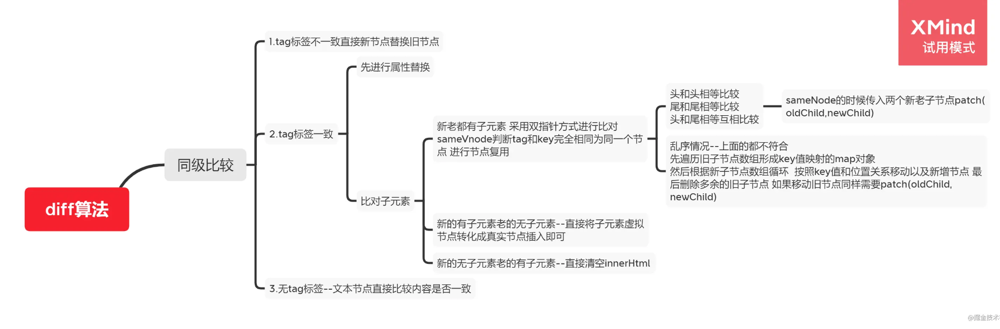

# Vue

> 本目录关注`Vue`框架的面试向问题，非源码解析，主要是原理理解，源码解析会另外开一个项目

## 1. Vue的`优点`和`缺点`

* 优点：渐进式、组件化、轻量级、虚拟dom、响应式、单页面路由、数据与视图分开
* 缺点：单页面不利于seo、不支持ie8以下、首屏加载时间长（？？）

## 2. 什么是渐进式框架

> * 通俗讲，可以只用一部分功能，而不必使用其全部，并且可以跟其它框架结合使用
> * 框架做分层设计，每层都可选，不同层可以灵活接入其他方案。而当你都想用官方的实现时，会发现也早已准备好，各层之间包括配套工具都能比接入其他方案更便捷地协同工作
> * 详细的话可以看[Vue2.0 中，“渐进式框架”和“自底向上增量开发的设计”这两个概念是什么？](https://www.zhihu.com/question/51907207)

## 3. MVVM和MVC

> `MVC`：
>
> 
>
> * `Model（模型）`：程序中用于处理数据逻辑的部分，通常负责在数据库中存取数据
> * `View（视图）`：程序中处理数据展示的部分，通常是依据模型数据创建的
> * `Controller（控制器）`：程序中处理用户交互的部分，通常负责从视图读取数据，控制用户输入，并向模型发送数据
> * `思想`：`Controller`将`Model`的数据用`View`展示出来（即在`Controller`里把`Model`的数据赋值给`View`）
>
> `MVVM`：
>
> 
>
> * `VM`（ViewModel）：在vue中无法观察到的，它主要实现了数据的双向绑定将Model，即
>   * `模型`转化成`视图`，即将后端返回的数据转化成所看到的页面（数据绑定）
>   * `视图`转化成`模型`，即将所看到的页面转化成后端的数据（DOM事件监听）
>
> `区别`：
>
> * MVVM实现了Model和View的自动同步，当Model的属性改变时，对应View层的显示会自动改变（对应Vue`数据驱动`的思想），不需要手动去操作DOM元素改变View
> * MVVM比MVC要精简很多：简化了业务与界面的依赖，解决了数据频繁更新的问题（不用再用选择器操作DOM元素）
> * MVVM的低耦合模式提高了代码的可复用性：因为View不知道Model的存在，Model和ViewModel也观察不到View
>
> `注意`：
>
> Vue并没有完全遵循MVVM思想（官方有说），理由：严格的MVVM要求View不能和Model直接通信，但是Vue提供了$refs这个属性，让Model可以直接操作View，违反了这一规定，所以说Vue并没有完全遵循MVVM

## 4. 为什么data是一个函数

* 如果data是一个对象，组件复用的时候，所有组件实例会公用一份data
* data写成一个函数，组件复用的时候，都重新给data申请一份数据空间，每个组件实例就都有自己的data，各自维护自己的数据

## 5. Vue组件的通讯方式有哪些

* props：父->子
* provide、inject：父组件->子孙组件
* $parent、$children：获取当前组件的父组件、子组件
* $emit：子->父
* $attrs、$listeners：A->B->C的解决方案（Vue2.4开始提供）
* $refs：获取组件实例
* eventBus：事件总线，兄弟组件的数据传递
* vuex：状态管理（类似全局变量）

## 6. Vue生命周期

created、beforeMounted和mounted可以发请求（如果不用操作dom，一般都是放created）

## 7. v-if和v-show的区别

* v-if在编译过程中会被转化成三元表达式，条件不满足时不渲染此节点
* v-show会被编译成指令，条件不满足时样式变为display:none

## 8. 说说Vue内置指令


## 9. 为什么v-for时不能使用index作为key

首先，`key的作用`：为了高效更新虚拟DOM

基于Vue的Diff算法考虑，其基于两个简单的假设

>* 两个相同的组件产生类似的DOM结构，不同的组件产生不同的DOM结构
>* 同一层级的一组节点，它们可以通过唯一的id进行区分（也就是key）

基于上面的假设，使用虚拟DOM的Diff算法复杂度从`O(n3)`降到了`O(n)`

回到问题，概括原因如下（细节不记得的话，看下面的链接）：

> 使用index作为key
>
> * 更新DOM的时候会出现性能问题（比如有4条表格数据，删除第2条，后面两条（后面所有）都会被重新渲染，因为key和节点的绑定关系变化了，之前key=3，绑定的是第3条，现在变为第4条）
> * 会引发bug（还是上面的删除例子，如果一开始选中3，删除后，会变成4被选中了）
>
> 最后：除非是一些纯展示的，不会再变更的数据，否则不要是否index作为key

参考文章：

[vue中使用v-for时为什么不能用index作为key？](https://blog.csdn.net/aihuanhuan110/article/details/98223011)

[我用index作为key也没啥问题啊](https://juejin.cn/post/6999932053466644517)

## 10. 怎么理解`Vue`的单向数据流

* 子组件不能直接修改父组件的数据，只能请求父组件对原始数据进行修改，否则如果在子组件随意修改父组件的数据，会难以掌控数据流向和变更（就不知道在哪被修改了，子组件每个地方都可能修改父组件的数据）
* `但是`：封装了这样的一个子组件，只是用了绑定v-model表单项，其余地方都不需要修改父组件的数据，这样如果还需要在子组件声明一个data属性，修改完后再通知父组件同步，好像会很麻烦，还不如直接绑定来得简单，`如何处理这个问题呢？TODO`

## 11. `v-if`和`v-for`为什么不建议在同一个标签一起使用

解析时先解析v-for后解析v-if，浪费性能

## 12. `Vue2`数据双向绑定原理

具体看子目录 [双向绑定原理](./双向绑定原理/readme.md)

## 13. `Vue`如何检测数组变化

* vue考虑性能原因，没有用defineProperty对数组每一项进行劫持，而是选择对7中数组方法（`push、shift、pop、splice、unshift、sort、reverse`）进行重写（`AOP切片思想`）
* 所以在vue中修改数组索引和长度无法监控到，需要通过以上7中变异方法修改数组才会触发数组对应的watcher进行更新


## 14. vue3


## 15. vue3和vue2的响应式原理的区别

Vue3改用proxy替代Object.defineProperty，因为Proxy可以直接监听对象和数组的变化，并且多达13种拦截方法

## 16. Vue父子组件生命周期钩子函数执行顺序

* 加载渲染过程

  > 父：beforeCreated -> created -> beforeMount ->          				                         mounted
  >
  > 子：   					                  beforeCreate -> created -> beforeMount -> mounted ->

* 子组件更新过程

  > 父：beforeUpdate ->                          updated
  >
  > 子：               beforeUpdate -> updated ->

* 父组件更新过程

  > 父：beforeUpdate -> updated

* 销毁过程

  > 父：beforeDestroy ->                             destroyed
  >
  > 子：                beforeDestroy -> destroyed ->

## 17. 虚拟DOM是什么？有什么优缺点

具体看子目录：[虚拟DOM]('./虚拟DOM/readme.md')

## 18. v-model原理

v-model是个语法糖，在内部为不同的输入元素使用不同的property并抛出不同的事件：

* 元素内部：

  > text和textarea：使用value属性和input事件
  >
  > checkbox和radio：使用checked属性和change事件
  >
  > select元素：使用value和change事件

* 元素外部（属性绑定）：

  > `v-model="test"` => `v-bind:value="test"`
  >
  > ​					`v-on:input="test = $event.target.value"`

## 19. v-for为什么要加key

* key是Vue中Vnode的唯一标识，通过这个key，diff操作可以更准确、更快速

  > `更准确`：因为带了key就不是就地服用了，在sameNode函数a.key === b.key对比中可以避免就地复用的情况，所以会更加准确
  >
  > `更快速`：利用key的唯一性生成map对象来获取对应节点，比遍历方式快
  >
  > 相关代码：
  >
  > ```javascript
  > // 判断两个vnode的标签和key是否相同，如果相同，则认为是同一节点，就地复用
  > function isSameVnode (oldVnode, newVnode) {
  >     return oldVnode.tag === newVnode.tag && oldVnode.key === newVnode.key;
  > }
  > 
  > // 生成老的子节点的index映射表，类似{a:0,b:1}，表示key为a的节点在第一个位置，key为b的在第二个
  > function makeIndexByKey (children) {
  >     let map = new Map();
  >     Array.from(children).forEach((item, index) => {
  >         map.set(item.key, index);
  >     });
  >     return map;
  > }
  > let map = makeIndexByKey(oldChildren);
  > ```

* 如果不使用key，Vue会使用一种最大限度减少动态元素并且尽可能的尝试`就地修改或复用`相同类型元素的算法（而使用key时，它会基于key的变化重新排列元素顺序，并且会移除key不存在的元素）

  > `就地复用`（官方解释）：如果数据项的顺序被改变，Vue将不会移动DOM元素来匹配数据项的顺序，而是简单复用此处的每个元素
  >
  > 例如看gif图 [example.gif]('./img/example.gif')

## 20. Vue事件绑定原理

原理是发布-订阅模式，在初始化时`解析器`会解析绑定的指令，有v-on的则将事件监听用addEventlistener注册（即订阅），然后在事件触发后即$emit发布后执行对应的处理函数

详情看[双向绑定原理](./双向绑定原理/readme.md)

## 21. `vue-router`路由钩子函数是什么？执行顺序是怎样的？

* 钩子函数种类有：`全局守卫`、`路由守卫`、`组件守卫`

* 完整的导航解析流程：

  > 1. 导航被触发
  > 2. 在失活的组件里调用`beforeRouteLeave`守卫
  > 3. 调用全局的`beforeEach`守卫
  > 4. 在重用的组件里调用`beforeRouteUpdate`守卫（2.2+）
  > 5. 在路由配置里调用`beforeEnter`（路由独享的守卫）
  > 6. 解析异步路由组件
  > 7. 在被激活的组件里调用`beforeRouteEnter`
  > 8. 调用全局的`beforeResolve`守卫（2.5+）
  > 9. 导航被确认
  > 10. 触发DOM更新
  > 11. 调用`beforeRouteEnter`守卫中传给`next`的回调函数，创建好的组件实例会作为回调函数的参数传入
  >
  > 参考官方文档：[导航守卫]([https://router.vuejs.org/zh/guide/advanced/navigation-guards.html#%E7%BB%84%E4%BB%B6%E5%86%85%E7%9A%84%E5%AE%88%E5%8D%AB](https://router.vuejs.org/zh/guide/advanced/navigation-guards.html#组件内的守卫))

## 22. `vue-router`的动态路由是什么？有什么问题

* 动态路由

  > 我们经常需要把某种模式匹配到的所有路由，全部映射到同个组件。例如，我们有一个User组件，对于所有ID各不相同的用户，都要使用这个组件来渲染。那么，我们可以在vue-router的路由路径中使用`动态路径参数`(dynamic segment)来达到这个效果
  >
  > ```javascript
  > const User = {
  >     template: "<div>User</div>"
  > };
  > const Router = new VueRouter({
  >     routes: [
  >         // 动态路由参数 以冒号开头
  >         { path: "/user/:id", component: User }
  >     ]
  > });
  > ```
  >
  > 

* 问题：vue-router组件复用导致路由参数失效怎么办？

  > 解决：
  >
  > * 通过watch监听路由参数再发请求
  >
  >   ```javascript
  >   watch: {
  >       '$route' () {
  >           this.getData(this.$route.params.xxx);
  >       }
  >   }
  >   ```
  >
  > * 使用:key来阻止复用
  >
  >   ```javascript
  >   <router-view :key="$route-fullPath" />
  >   ```

## 23. Vuex的理解

* vuex是专门为vue提供的全局状态管理系统，用于多个组件中数据共享、数据缓存等（无法持久化、内部核心原理是通过创造一个全局实例 new Vue）
* 主要

包要包括以下几个模块：

> * State：定义了应用状态的数据结构，可以在这里设置默认的初始状态（辅助函数mapState）
>
> * Getter：欲奴组件从Store中获取数据，mapGetter辅助函数仅仅是将store中的getter映射到局部计算属性（Getter可认为是store的计算属性，比如要对state某个属性做处理后输出）（辅助函数mapGetter）
>
> * Mutation：是唯一更改store中状态的方法，且必须是同步函数（辅助函数mapMutation）
>
> * Action：用于提交mutation（即在action函数中调用commit），而不是直接变更状态，可包含异步操作（辅助函数mapAction）
>
>   `最好是规定有异步需求的才使用action，否则会出现action和motation使用混乱的问题，即像当前这个项目，同步操作有使用mutation的，有使用action的`
>
> * Module：允许将单一的Store拆分为多个store且同时保存在单一的状态树种（一般是按业务模块划分）
>
> 参考官方文档：[vuex](https://vuex.vuejs.org/zh/guide/state.html)


## 24. vuex页面刷新数据丢失怎么解决

即vuex的数据持久化，一般使用第三方插件，比如vuex-persist插件，将状态保存至cookie或者localStorage中，不需要手动操作

## 25. vuex为什么要分模块并且加命名空间

* 模块：当应用变更非常复杂时，store对象就会变得很臃肿（需要在state里面声明状态变量会很庞大），所以需要分模块，允许每个模块拥有自己的state、mutation、action、getter、甚至是嵌套子模块
* 命名空间：即便是分模块，所有的action、mutation、getter都是注册在全局命名空间的，难管理和有可能会冲突，所以允许有自己的命名空间，使用getter、action、mutation时会自动根据模块注册的路径调整命名

## 26. `Vue-SSR`是什么？

ssr就是服务端渲染，就是将vue在客户端把标签渲染成html的工作放到服务端完成，然后再把html直接返回给客户端，以提高性能

优点：ssr有更好的seo、且首屏加载速度更快

缺点：

* 开发条件会受到限制，服务端渲染只支持beforeCreate和created两个钩子，但我们需要一些外部拓展库时需要特殊处理，服务端渲染应用程序也需要运行在node环境上
* 对服务器有更大的负载需求

## 27. `Vue`中都使用了哪些设计模式

> * `工厂模式`：传入参数即可创建势力
> * `单例模式`：整个程序有且仅有一个实例（vuex和vue-router的插件注册方法install，判断如果系统存在实例就直接返回掉）
> * `发布-订阅模式`：vue事件机制
> * `观察者模式`：响应式数据原理
> * `装饰模式`：装饰器的用法
> * `策略模式`：策略模式指对象有某个行为，但是在不同的场景中，该行为有不同的实现方案，比如选项中的合并策略

## 28. 都有哪些vue的性能优化

> 只列举针对`Vue`的性能优化
>
> * 对象层级不要过程，否则性能就会差
>
> * 不需要响应式的数据不要放到data中（可以用Object.freeze()冻结数据，或者常量一般都是放到computed中声明）
>
>   如果常量放到data，可以结合响应式数据实现原理，会生成对应的订阅器dep、订阅者watcher，且init时会调用observer监听者（defineReactive）对属性进行监听（Objext.defineProperty加getter和setter）
>
> * v-if和v-show区分使用场景，能用v-show就尽量用v-show
>
> * computed和watch区分使用场景，能用computed就尽量用computed
>
> * v-for遍历必须加key（提高diff性能），且v-for不能和v-if同时使用
>
> * 大数据列表和表格性能优化：虚拟列表/虚拟表格（可视区域和可滚动区域）
>
> * 组件销毁后把全局变量和时间销毁，防止内存泄露
>
> * 图片懒加载
>
> * 路由懒加载
>
> * 第三方插件按需引入
>
> * 适当采用keep-alive缓存组件
>
> * 防抖、节流的运用
>
> * 服务端渲染 SSR 或者 预渲染

## 29. `Vue.mixin`的使用场景和原理

* 使用场景：

  > 不同组件有相同或者相似的代码或者逻辑，这些代码的功能又相对独立，这样就可以通过mixin抽离出公共的业务逻辑

* 原理

  > 类似`对象继承`，当组件初始化时会调用mergeOptions方法进行合并，采用策略模式针对不同的属性进行合并
  >
  > 具体原理分析：[mixin](./mixins原理/readme.md)
  
  ```javascript
  // Vue源码
  export default function initMixin (Vue) {
          Vue.mixin = function (mixin) {
              // 合并对象
              this.options=mergeOptions(this.options,mixin)
          };
  	}
  };
  
  // 合并策略
  const strats = {};
  // mixin核心方法
  export function mergeOptions (parent, child) {
      const options = {};
      // 遍历父亲
      for (let k in parent) {
          mergeFiled(k);
      }
      // 父亲没有 儿子有
      for (let k in child) {
          if (!parent.hasOwnProperty(k)) {
              mergeFiled(k);
          }
      }
  
      //真正合并字段方法
      function mergeFiled (k) {
          if (strats[k]) {
              options[k] = strats[k](parent[k], child[k]);
          } else {
              // 默认策略
              options[k] = child[k] ? child[k] : parent[k];
          }
      }
      return options;
  }
  ```

## 30. `nextTick`使用场景和原理

* 使用场景

  > * 当改变数据后，需要获取更新后的dom，则需要使用nextTick
  > * nextTick的回调是在下次DOM更新循环结束后执行得延迟回调

* 原理

  > 采用微任务优先的方式调用异步方法去执行nextTick包装的方法
  >
  > 具体原理分析：[nextTick](./nextTick原理/readme.md)
  
  ```javascript
  // Vue相关核心源码
  /* @flow */
  /* globals MutationObserver */
  
  import { noop } from 'shared/util'
  import { handleError } from './error'
  import { isIE, isIOS, isNative } from './env'
  
  export let isUsingMicroTask = false
  
  const callbacks = []
  let pending = false
  
  function flushCallbacks () {
      pending = false
      const copies = callbacks.slice(0)
      callbacks.length = 0
      for (let i = 0; i < copies.length; i++) {
          copies[i]()
      }
  }
  
  // Here we have async deferring wrappers using microtasks.
  // In 2.5 we used (macro) tasks (in combination with microtasks).
  // However, it has subtle problems when state is changed right before repaint
  // (e.g. #6813, out-in transitions).
  // Also, using (macro) tasks in event handler would cause some weird behaviors
  // that cannot be circumvented (e.g. #7109, #7153, #7546, #7834, #8109).
  // So we now use microtasks everywhere, again.
  // A major drawback of this tradeoff is that there are some scenarios
  // where microtasks have too high a priority and fire in between supposedly
  // sequential events (e.g. #4521, #6690, which have workarounds)
  // or even between bubbling of the same event (#6566).
  let timerFunc
  
  // The nextTick behavior leverages the microtask queue, which can be accessed
  // via either native Promise.then or MutationObserver.
  // MutationObserver has wider support, however it is seriously bugged in
  // UIWebView in iOS >= 9.3.3 when triggered in touch event handlers. It
  // completely stops working after triggering a few times... so, if native
  // Promise is available, we will use it:
  /* istanbul ignore next, $flow-disable-line */
  if (typeof Promise !== 'undefined' && isNative(Promise)) {
      const p = Promise.resolve()
      timerFunc = () => {
          p.then(flushCallbacks)
          // In problematic UIWebViews, Promise.then doesn't completely break, but
          // it can get stuck in a weird state where callbacks are pushed into the
          // microtask queue but the queue isn't being flushed, until the browser
          // needs to do some other work, e.g. handle a timer. Therefore we can
          // "force" the microtask queue to be flushed by adding an empty timer.
          if (isIOS) setTimeout(noop)
      }
      isUsingMicroTask = true
  } else if (!isIE && typeof MutationObserver !== 'undefined' && (
      isNative(MutationObserver) ||
      // PhantomJS and iOS 7.x
      MutationObserver.toString() === '[object MutationObserverConstructor]'
  )) {
      // Use MutationObserver where native Promise is not available,
      // e.g. PhantomJS, iOS7, Android 4.4
      // (#6466 MutationObserver is unreliable in IE11)
      let counter = 1
      const observer = new MutationObserver(flushCallbacks)
      const textNode = document.createTextNode(String(counter))
      observer.observe(textNode, {
          characterData: true
      })
      timerFunc = () => {
          counter = (counter + 1) % 2
          textNode.data = String(counter)
      }
      isUsingMicroTask = true
  } else if (typeof setImmediate !== 'undefined' && isNative(setImmediate)) {
      // Fallback to setImmediate.
      // Technically it leverages the (macro) task queue,
      // but it is still a better choice than setTimeout.
      timerFunc = () => {
          setImmediate(flushCallbacks)
      }
  } else {
      // Fallback to setTimeout.
      timerFunc = () => {
          setTimeout(flushCallbacks, 0)
      }
  }
  
  export function nextTick (cb?: Function, ctx?: Object) {
      let _resolve
      callbacks.push(() => {
          if (cb) {
              try {
                  cb.call(ctx)
              } catch (e) {
                  handleError(e, ctx, 'nextTick')
              }
          } else if (_resolve) {
              _resolve(ctx)
          }
      })
      if (!pending) {
          pending = true
          timerFunc()
      }
      // $flow-disable-line
      if (!cb && typeof Promise !== 'undefined') {
          return new Promise(resolve => {
              _resolve = resolve
          })
      }
  }
  ```

## 31. `keep-alive`使用场景和原理

* 概念：

  > Vue的内置组件，可实现组件缓存，当组件切换时不会对当前组件进行卸载
  >
  > * 常用的两个属性`include/exclude`，允许组件有条件地进行缓存
  > * 两个生命周期`activated/deactivated`，用来得知当前组件是否处于活跃状态
  > * `keep-alive`运用了`LRU`（最近最少使用）算法，选择最近最久未使用的组件予以淘汰

* LRU：所以当缓存数量达到最大值时，我们就删除将来被访问几率最低的数据

## 32. `Vue.$set`方法原理

1. 以下修改数据情况不会触发视图更新：

   * 在实例创建后添加新的属性到实例上（给响应式对象新增属性）

   * 直接更改数组下标来修改数组的值

2. 原理：

> * 修改对象：对新的属性进行响应式跟踪，然后触发对应订阅器收集到的watcher去更新
> * 修改数组：调用数组本身的splice方法去更新数组
>
> ```javascript
> // 源码
> export function set (target: Array<any> | Object, key: any, val: any): any {
>     if (process.env.NODE_ENV !== 'production' &&
>         (isUndef(target) || isPrimitive(target))
>        ) {
>         warn(`Cannot set reactive property on undefined, null, or primitive value: ${(target: any)}`)
>     }
>     if (Array.isArray(target) && isValidArrayIndex(key)) {
>         target.length = Math.max(target.length, key)
>         target.splice(key, 1, val)
>         return val
>     }
>     if (key in target && !(key in Object.prototype)) {
>         target[key] = val
>         return val
>     }
>     const ob = (target: any).__ob__
>     if (target._isVue || (ob && ob.vmCount)) {
>         process.env.NODE_ENV !== 'production' && warn(
>             'Avoid adding reactive properties to a Vue instance or its root $data ' +
>             'at runtime - declare it upfront in the data option.'
>         )
>         return val
>     }
>     if (!ob) {
>         target[key] = val
>         return val
>     }
>     defineReactive(ob.value, key, val)
>     ob.dep.notify()
>     return val;
> }
> ```

## 33. `Vue.extend`作用和原理

* 作用：用于`继承`，创建一个子类

* 原理：使用`原型继承`的方法返回了Vue的子类，然后利用`mergeOptions`把传入组件的`options`和父类的`options`进行合并

  ```javascript
  // 相关代码
  export default function initExtend(Vue) {
      let cid = 0; //组件的唯一标识
      // 创建子类继承Vue父类 便于属性扩展
      Vue.extend = function (extendOptions) {
          // 创建子类的构造函数 并且调用初始化方法
          const Sub = function VueComponent(options) {
              this._init(options); //调用Vue初始化方法
          };
          Sub.cid = cid++;
          Sub.prototype = Object.create(this.prototype); // 子类原型指向父类
          Sub.prototype.constructor = Sub; //constructor指向自己
          Sub.options = mergeOptions(this.options, extendOptions); //合并自己的options和父类的options
          return Sub;
      };
  }
  ```

## 34. 自定义指令和原理

* 概念：

  > 1. 本质上是装饰器，是Vue对HTML元素的拓展，给HTML元素增加自定义功能。
  > 2. Vue编译DOM时，会找到指令对象，执行指令的相关方法
  > 3. 自定义指令有5个生命周期（钩子），分别是
  >    * bind：只调用一次，指令第一次绑定到元素时调用，在这里可以进行一次性的初始化设置
  >    * inserted：被绑定元素插入父节点时调用（仅保证父节点存在，但不一定已被插入文档中）
  >    * update：被绑定元素所在的模板更新时调用，无论绑定值是否变化（通过比较更新新旧值，没发生变更可以不进行操作）
  >    * componentUpdated：被绑定元素所在模板完成一次更新周期时调用
  >    * unbind：只调用一次，指令与元素解绑时调用

* 原理：

  > 1. 在生成`ast`语法树时，遇到指令会给当前元素添加`directives`属性
  > 2. 通过`genDirectives`生成指令代码
  > 3. 在`patch`前将指令的钩子提取到`cbs`中,在`patch`过程中调用对应的钩子
  > 4. 当执行指令对应钩子函数时，调用对应指令定义的方法

## 35. Vue修饰符有哪些

* 事件修饰符

  > `.stop`：阻止单击事件继续传播
  >
  > `.prevent`：阻止标签默认行为
  >
  > `.capture`：使用事件捕获模式，即元素自身触发的事件先在此处处理，然后才交由内部元素进行处理
  >
  > `.self`：只有event.target是当前元素自身时触发处理函数
  >
  > `.once`：事件只会触发一次（2.1.4+）
  >
  > `.passive`：告诉浏览器你不想阻止事件的默认行为（2.3.0）

* v-model的修饰符

  > `.lazy`：通过这个修饰符，转变为在change事件再同步
  >
  > `.number`：自动将用户的输入值转化为数值类型
  >
  > `.trim`：自动过滤首尾空格

* 键盘事件修饰符

  > `.enter`
  >
  > `.tab`
  >
  > `.delete`
  >
  > `.esc`
  >
  > `.space`
  >
  > `.up`
  >
  > `.down`
  >
  > `.left`
  >
  > `.right`
  >
  > ```html
  > <input @keyup.enter="submit">
  > ```
  >
  > 

* 系统修饰符

  >`.ctrl`
  >
  >`.alt`
  >
  >`.shift`
  >
  >`.meta`
  >
  >`.exact`：修饰符允许你控制由精确的系统修饰符组合触发的事件（2.5.0+）
  >
  >```html
  ><!-- Alt + C -->
  ><input v-on:keyup.alt.67="clear">
  >
  ><!-- Ctrl + Click -->
  ><input v-on:click.ctrl="doSomething">
  >
  ><!-- 即使 Alt 或 Shift 被一同按下时也会触发 -->
  ><button v-on:click.ctrl="onClick">A</button>
  >
  ><!-- 有且只有 Ctrl 被按下的时候才触发 -->
  ><button v-on:click.ctrl.exact="onCtrlClick">A</button>
  >```
  >
  >

* 鼠标按钮修饰符（2.2.0+）

  > `.left`
  >
  > `.right`
  >
  > `.middle`

## 36. Vue模板编译原理

`Vue`的编译过程就是将`template`转化为`render`函数的过程，分为三步

> 1. 将模板字符串转换成`element ASTs`（解析器）
> 2. 对`AST`进行静态节点标记，主要用来做虚拟`DOM`的渲染优化（优化器）
> 3. 使用`element ASTs`生成`render`函数代码字符串（代码生成器）

## 37. 生命周期钩子是如何实现的

* 概念：`Vue`的生命周期钩子核心实现是利用`发布订阅模式`先把用户传入的的生命周期钩子订阅好（内部采用数组的方式存储）然后在创建组件实例的过程中会一次执行对应的钩子方法（发布）

* 相关代码

  ```javascript
  // .src/core/instance/lifecycle.js
  export function callHook (vm: Component, hook: string) {
      // #7573 disable dep collection when invoking lifecycle hooks
      pushTarget()
      const handlers = vm.$options[hook]
      const info = `${hook} hook`
      if (handlers) {
          for (let i = 0, j = handlers.length; i < j; i++) {
              invokeWithErrorHandling(handlers[i], vm, null, vm, info)
          }
      }
      if (vm._hasHookEvent) {
          vm.$emit('hook:' + hook)
      }
      popTarget()
  }
  
  // 调用
  callHook(vm, 'beforeCreate');
  ...
  callHook(vm, 'created');
  ```

## 38. 函数式组件使用场景和原理

* 参数：

  > 1. `functional`：设置为true 即表示该组件为一个函数组件
  > 2. `props`（可选）：传递值到组件内部，2.3.0版本后可以省略，框架会自动将组件上的特性解析为prop
  > 3. `render`函数：提供渲染函数来返回一个vnode
  >
  > __2.5.0+，可以单文件定义函数式组件__
  >
  > ```html
  > <template functional>
  >   <button
  >     class="btn btn-primary"
  >     v-bind="data.attrs"
  >     v-on="listeners">
  >     <slot/>
  >   </button>
  > </template>
  > ```

* 函数式组件与普通组件的区别：

  > 1. 函数式组件需要在声明组件是指定`functional:true`
  > 2. 不需要实例化，所以没有`this`，`this`通过`render`函数的第二个参数`context`来代替
  > 3. 没有生命周期钩子函数，不能使用计算属性，`watch`
  > 4. 不能通过`$emit`对外暴露事件，调用事件只能通过`context.listeners.click`的方式调用外部传入的事件
  > 5. 因为函数式组件是没有实例化的，所以在外部通过`ref`去引用组件时，实际引用的是`HTMLElement`
  > 6. 函数式组件的`props`可以不用显示声明，所以没有在`props`里面声明的属性都会被自动隐式解析为`prop`，而普通组件所有未声明的属性都解析到`$attrs`里面，并自动挂载到组件根元素上面(可以通过inheritAttrs属性禁止)

* 优点：

  > 1. 由于函数式组件不需要`实例化`、`无状态`、`没有生命周期`，所有`渲染性能`要好于普通组件
  > 2. 函数式`组件结构`比较简单，代码结构清晰

* 使用场景：

  > 1. 一个简单的展示组件，作为容器组件使用，比如router-view就是一个函数式组件，比如router-link组件、collapse展开收起组件
  > 2. 高阶组件：用于接收一个组件作为参数，返回一个被包装过的组件

## 39. Vue-router常用的路由模式实现原理

* __hash模式__

  > 1. `location.hash`的值实际就是URL中`#`后面的东西
  >
  >    * hash虽然出现在URL中，但不会被包含在HTTP请求中，对后端完全没有影响，因此改变hash不会重新加载页面
  >
  > 2. 可以为hash的改变添加监听事件
  >
  >    > window.addEventListener('hashchange', fun, false);
  >
  > 3. 每次改变hash(window.location.hash)，都会在浏览器的访问历史中增加一个记录，利用以上特点，就可以实现前端路由`更新视图但不重新请求页面`的功能了
  >
  >    
  >
  > `特点`：兼容性好，但不美观（个人观点：其实也不会不美观，只是多了hash值）

* __history模式__

  > 利用了`HTML5 History Interface`中新增的`pushState()`和`replaceState()`方法
  >
  > * 这两个方法应用于浏览器的历史记录栈，在当前已有的back、forward、go的基础上，它们提供了对历史记录进行修改的功能
  >
  > * 这两个方法有个共同的特点：当调用它们修改浏览器历史记录栈后，虽然当前URL改变了，但浏览器不会刷新页面，这就为单页应用前端路由`更新视图但不重新请求页面`提供了基础
  >
  >   
  >
  > `特点`：虽然美观，但是刷新会出现404，需要后端进行配置

## 40. Diff算法原理




参考文章：

* [最全的 Vue 面试题+详解答案](https://juejin.cn/post/6961222829979697165#heading-2)
* [「自我检验」熬夜总结50个Vue知识点，全都会你就是神！！！](https://juejin.cn/post/6984210440276410399)