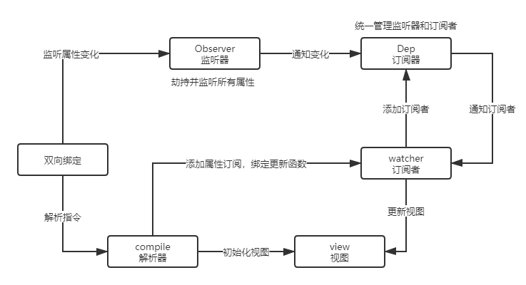

# 双向绑定

## 原理

> `双向数据绑定的方式`
>
> * 发布订阅模式
> * Angular的脏查机制
> * 数据劫持
>
> `Vue的方式`
>
> * 采用数据劫持与发布订阅相结合的方式（数据劫持主要通过`Object.defineProperty`来实现）
>
> `步骤`：
>
> 1. 监听器：`劫持`并`监听`所有属性，如果属性发生变化，`通知订阅者`
> 2. 订阅器：用来`收集订阅者`，对监听器和订阅者进行`统一管理`
> 3. 订阅者：收到属性变化的通知并`执行相应的方法`，从而`更新视图`
> 4. 解析器：`解析`每个节点的相关`指令`，对模板数据和订阅器进行`初始化`（绑定订阅者）

__图解__

## 监听器-Observer

> 概览：
>
> 监听器的实现，主要是指让数据对象变得`可观测`，即每次数据读或写时，我们能感知到

## 订阅器

>* 依赖收集容器，用来容纳所有的订阅者，然后当数据变化时执行对应订阅者的更新函数。
>* 每个属性都拥有自己的订阅器，存放它的订阅者

## 订阅者

> 订阅者`Watcher`在初始化的时候需要将自己添加进订阅器`Dep`中，那该如何添加呢？我们已经知道监听器`Observer`是在get函数执行了添加订阅者`Watcher`的操作的，所以我们只要在订阅者`Watcher`初始化的时候触发对应的`get`函数去执行添加订阅者操作即可，那要如何触发`get`的函数，再简单不过了，只要获取对应的属性值就可以触发了，核心原因就是因为我们使用了`Object.defineProperty()`进行数据监听。这里还有一个细节点需要处理，我们只要在订阅者`Watcher`初始化的时候才需要添加订阅者，所以需要做一个判断操作，因此可以在订阅器上做一下手脚：在`Dep.target`上缓存下订阅者，添加成功后再将其去掉就可以了
>

## 解析器

> 解析器`Compile`实现步骤：
>
> - 解析模板指令，并替换模板数据，初始化视图；
> - 将模板指令对应的节点绑定对应的更新函数，初始化相应的订阅器；